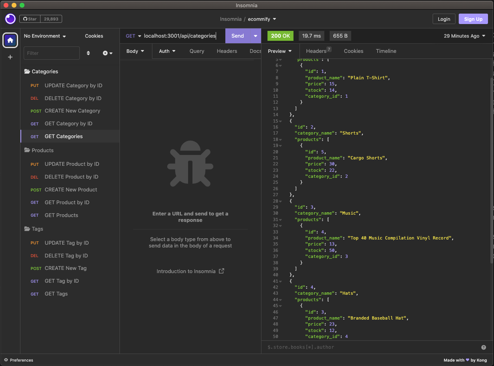

# Ecommify

## Badges

## Description
The back-end of an ecommerce website, with a database containing tables for products, categories and tags, and routes for getting, adding, editing and deleting data.

## Table of Contents
- [Installation](#installation)
- [Usage](#usage)
- [License](#license)
- [Questions](#questions)

## Installation
1. Using Node.js, use command 'npm i' to install all package dependencies
2. Using MySQL, initiate the database by copying commands from schema.sql file in 'db' directory
3. Once schema has been created, run command 'npm run seed' to seed the database
4. Run command npm start to start the application's server

## Usage
An application like 'Insomnia' may be used to test API routes:

## Video Walkthrough
https://watch.screencastify.com/v/4M5xvHCH2yqpW0epeSwc

## License
All assets and code are under MIT License unless specified otherwise.

## Questions
Any questions? Visit my GitHub profile at [https://github.com/katyjmt](https://github.com/katyjmt) or email me at [katyjmt@gmail.com](katyjmt@gmail.com).
